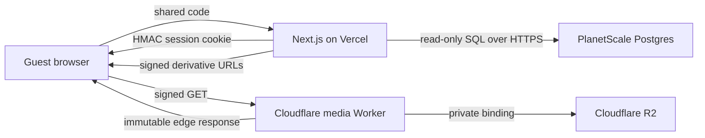

# Alex & Sierra's wedding gallery

A private, read-only wedding photo gallery built with Next.js. Guests enter one
shared access code; the application then serves paginated photo metadata from
PlanetScale and short-lived signed image URLs through a Cloudflare Worker backed
by a private R2 bucket.

The former Supabase anonymous-user, named-login, realtime, and guest-upload
flows have been removed. Source photographs never ship with the application and
are never committed to Git.

## Architecture



- `src/pages/index.tsx` is the code entrance.
- `src/pages/gallery/index.tsx` is the responsive, sortable, infinite gallery.
- `src/pages/api/` owns authentication and paginated metadata delivery.
- `src/lib/gallery-session.ts` signs and verifies stateless sessions.
- `src/lib/gallery-db.ts` performs server-only PlanetScale queries and signs
  media URLs.
- `cloudflare/media-worker.mjs` authenticates each image request before serving
  private R2 objects through an edge cache.
- `scripts/` contains the resumable, metadata-stripping derivative and import
  pipeline.
- `database/001_wedding_photos.sql` owns the isolated PostgreSQL schema.

See [the production inventory](docs/production.md),
[the media runbook](docs/media-pipeline.md), and
[the database notes](database/README.md) for the operational details.

## Local development

Use Node.js 20 or newer.

```bash
npm install
cp .env.example .env.local
npm run dev
```

The required runtime settings are:

| Variable | Purpose |
| --- | --- |
| `DATABASE_URL` | Server-only PlanetScale Postgres connection string |
| `MEDIA_BASE_URL` | Deployed Cloudflare media Worker URL |
| `GALLERY_ALBUM_ID` | Album exposed by this deployment; defaults to `wedding` |
| `GALLERY_ACCESS_CODE_SHA256` | SHA-256 digest of the human access code |
| `GALLERY_SESSION_SECRET` | Random HMAC secret used only for the application session cookie |
| `MEDIA_SIGNING_SECRET` | Different random HMAC secret shared only with the media Worker |
| `GALLERY_COOKIE_DOMAIN` | Optional production cookie domain |
| `MEDIA_URL_TTL_SECONDS` | Optional signed-media lifetime; defaults to 6 hours |
| `GALLERY_SESSION_MAX_AGE_SECONDS` | Optional login lifetime; defaults to 30 days |

Generate values without storing the human code in the repository:

```bash
read -s GALLERY_CODE_INPUT
printf '%s' "$GALLERY_CODE_INPUT" | shasum -a 256
unset GALLERY_CODE_INPUT
openssl rand -base64 48 # GALLERY_SESSION_SECRET
openssl rand -base64 48 # MEDIA_SIGNING_SECRET; generate independently
```

Use a database role with `USAGE` on `wedding_photos` and `SELECT` on its
application tables. Keep the higher-privilege import credential separate from
Vercel.

## Checks

```bash
npm test
npm run typecheck
npm run build
npm run worker:check
npm audit
```

## Production sequence

1. Create the `wedding_photos` schema in PlanetScale.
2. Create a private R2 bucket and deploy the media Worker.
3. Export and transform the Photos album locally.
4. Upload every immutable derivative to R2.
5. Import the matching manifest into PlanetScale, publishing rows only after
   their objects exist.
6. Set the access-code digest and separate session/media secrets in Vercel; set
   only the media-signing secret in Cloudflare.
7. Add a Vercel Firewall rate-limit rule for `POST /api/auth/code`.
8. Deploy the existing Vercel project and validate both authorized and
   unauthorized paths.

The R2 bucket must remain private and `r2.dev` public access must stay disabled.
The human access code is represented only by its digest. The session secret
stays on Vercel; a different media-signing secret is shared with Cloudflare.
The Worker accepts signed URLs only, keeps immutable objects at the Cloudflare
edge for one year, and caps browser reuse at the URL's six-hour authorization
window.
